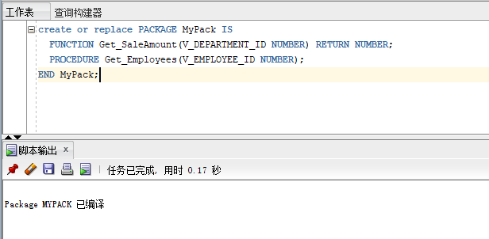
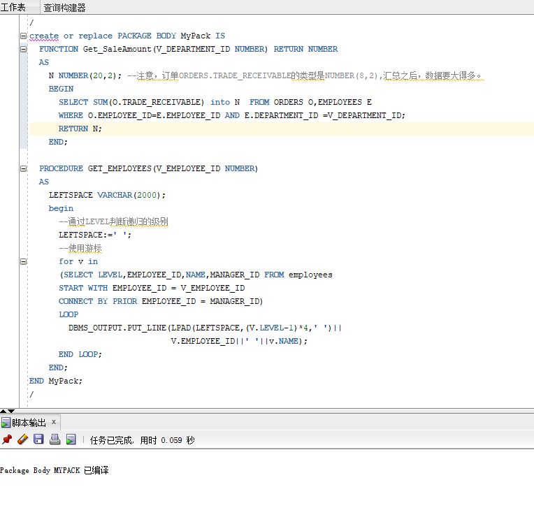
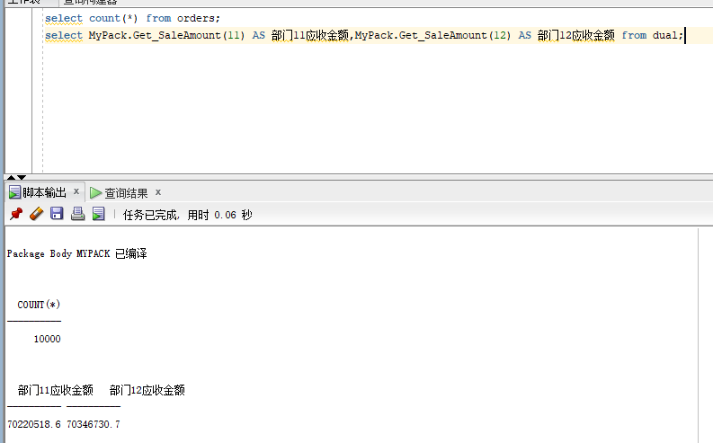
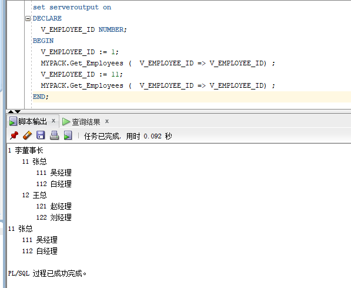

## 我的作业5

姓名：王浩

学号：201810414123

班级：软件工程1班

## 实验目的

```
了解PL/SQL语言结构
了解PL/SQL变量和常量的声明和使用方法
学习条件语句的使用方法
学习分支语句的使用方法
学习循环语句的使用方法
学习常用的PL/SQL函数
学习包，过程，函数的用法。
```

## 

## - 实验场景

- 假设有一个生产某个产品的单位，单位接受网上订单进行产品的销售。通过实验模拟这个单位的部分信息：员工表，部门表，订单表，订单详单表。
- 本实验以实验四为基础

## 

## 实验内容

1. 创建一个包(Package)，包名是MyPack。

   创建包代码：

   ```
   create or replace PACKAGE MyPack IS
     FUNCTION Get_SaleAmount(V_DEPARTMENT_ID NUMBER) RETURN NUMBER;
     PROCEDURE Get_Employees(V_EMPLOYEE_ID NUMBER);
   END MyPack;
   ```

   创建结果截图：

   

2. 在MyPack中创建一个函数SaleAmount ，查询部门表，统计每个部门的销售总金额，每个部门的销售额是由该部门的员工(ORDERS.EMPLOYEE_ID)完成的销售额之和。函数SaleAmount要求输入的参数是部门号，输出部门的销售金额。

   创建函数代码：

   ```
   create or replace PACKAGE BODY MyPack IS
     FUNCTION Get_SaleAmount(V_DEPARTMENT_ID NUMBER) RETURN NUMBER
     AS
       N NUMBER(20,2); --注意，订单ORDERS.TRADE_RECEIVABLE的类型是NUMBER(8,2),汇总之后，数据要大得多。
       BEGIN
         SELECT SUM(O.TRADE_RECEIVABLE) into N  FROM ORDERS O,EMPLOYEES E
         WHERE O.EMPLOYEE_ID=E.EMPLOYEE_ID AND E.DEPARTMENT_ID =V_DEPARTMENT_ID;
         RETURN N;
       END;
   ```

3. 在MyPack中创建一个过程，在过程中使用游标，递归查询某个员工及其所有下属，子下属员工。过程的输入参数是员工号，输出员工的ID,姓名，销售总金额。信息用dbms_output包中的put或者put_line函数。输出的员工信息用左添加空格的多少表示员工的层次（LEVEL）。比如下面显示5个员工的信息：

   ```
    ID 姓名 销售总金额
    =======================
    2  张三  5000元
    3 李四   6000元
    4 王五   1000元
        5 孙强  2000元
    6  赵强东 5000 元
   ```

   上述输出结果表示 2，6号两个员工是一个级别的，没有领导，3，4号员工的领导是2号，5号员工的领导是4号。 Oracle递归查询的语句格式是：

   ```
   ​```sql
   SELECT LEVEL,EMPLOYEE_ID,NAME,MANAGER_ID FROM employees 
   START WITH EMPLOYEE_ID = V_EMPLOYEE_ID 
   CONNECT BY PRIOR EMPLOYEE_ID = MANAGER_ID
   ​```
   ```

   创建过程代码：

   ```
    PROCEDURE GET_EMPLOYEES(V_EMPLOYEE_ID NUMBER)
     AS
       LEFTSPACE VARCHAR(2000);
       begin
         --通过LEVEL判断递归的级别
         LEFTSPACE:=' ';
         --使用游标
         for v in
         (SELECT LEVEL,EMPLOYEE_ID,NAME,MANAGER_ID FROM employees
         START WITH EMPLOYEE_ID = V_EMPLOYEE_ID
         CONNECT BY PRIOR EMPLOYEE_ID = MANAGER_ID)
         LOOP
           DBMS_OUTPUT.PUT_LINE(LPAD(LEFTSPACE,(V.LEVEL-1)*4,' ')||
                                V.EMPLOYEE_ID||' '||v.NAME);
         END LOOP;
       END;
   END MyPack;
   ```

   创建函数和过程结果截图：

   

4. 由于订单只是按日期分区的，上述统计是全表搜索，因此统计速度会比较慢，如何提高统计的速度呢？

   ```
1.按日期范围进行分区查询统计，避免全表搜索。
   2.在常用在条件中的字段建立索引以提高统计速度。
   ```
   
5. 函数Get_SaleAmount()测试方法：

   ```
   select count(*) from orders;
   select MyPack.Get_SaleAmount(11) AS 部门11应收金额,MyPack.Get_SaleAmount(12) AS 部门12应收金额 from dual;
   ```

   

   6.过程Get_Employees()测试代码：

   ```
   set serveroutput on
   DECLARE
     V_EMPLOYEE_ID NUMBER;    
   BEGIN
     V_EMPLOYEE_ID := 1;
     MYPACK.Get_Employees (  V_EMPLOYEE_ID => V_EMPLOYEE_ID) ;  
     V_EMPLOYEE_ID := 11;
     MYPACK.Get_Employees (  V_EMPLOYEE_ID => V_EMPLOYEE_ID) ;    
   END;
   ```

   