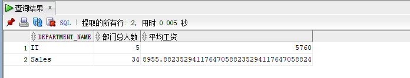
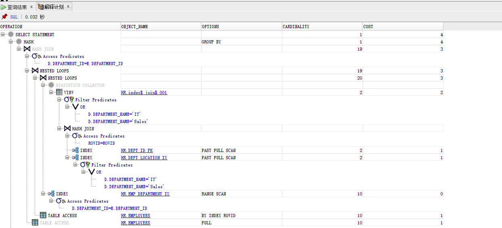
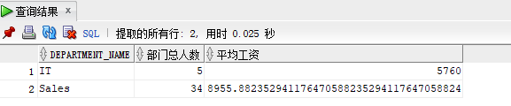
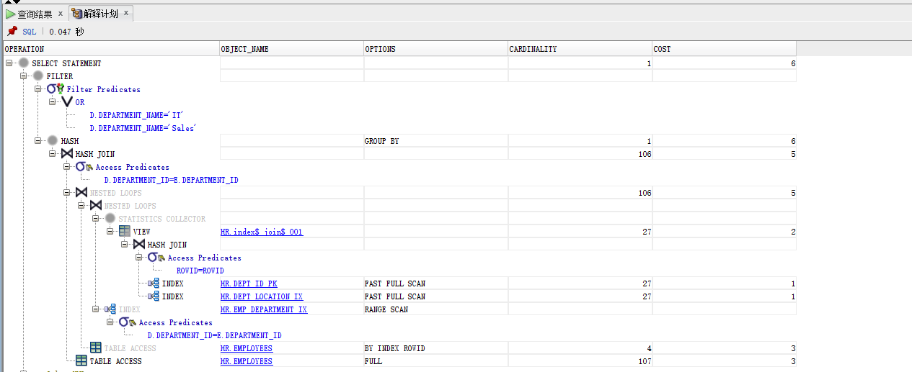
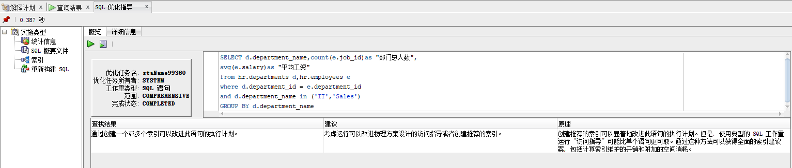
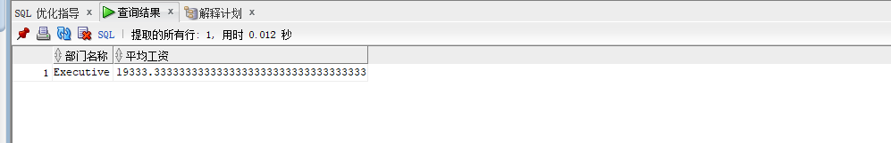
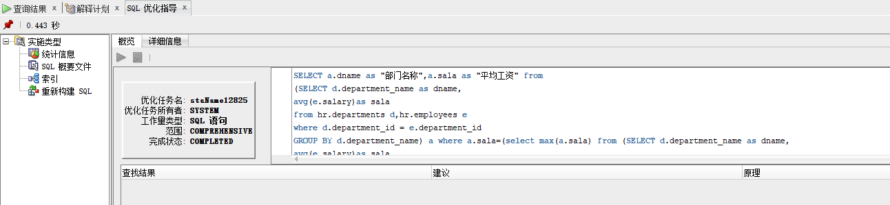

## 我的作业1

姓名：王浩

学号：201810414123

班级：软件工程1班

## 实验目的

分析SQL执行计划，执行SQL语句的优化指导。理解分析SQL语句的执行计划的重要作用。

## 实验内容

- 对Oracle12c中的HR人力资源管理系统中的表进行查询与分析。
- 首先运行和分析教材中的样例：本训练任务目的是查询两个部门('IT'和'Sales')的部门总人数和平均工资，以下两个查询的结果是一样的。但效率不相同。
- 设计自己的查询语句，并作相应的分析，查询语句不能太简单。

## 教材中的查询语句

查询1：

```
set autotrace on

SELECT d.department_name,count(e.job_id)as "部门总人数",
avg(e.salary)as "平均工资"
from hr.departments d,hr.employees e
where d.department_id = e.department_id
and d.department_name in ('IT','Sales')
GROUP BY d.department_name;
```

运行结果：



执行计划：



- 查询2

```
set autotrace on

SELECT d.department_name,count(e.job_id)as "部门总人数",
avg(e.salary)as "平均工资"
FROM hr.departments d,hr.employees e
WHERE d.department_id = e.department_id
GROUP BY d.department_name
HAVING d.department_name in ('IT','Sales');
```

运行结果：



执行计划：



## 执行计划分析及优化指导

##### 执行计划分析

   通过对上面两个查询的COST成本进行分析，发现第一个查询的COST成本为4，第二个查询的COST成本为6，第一个查询的成本低于第二个查询。查询1先过滤后汇总，查询2先汇总后过滤，查询1参与汇总与计算的数据量少于查询2，故用sqldeveloper优化指导工具对第一个查询进行优化指导。

##### 优化指导



建议：考虑运行可以改进物理方案设计的访问指导或者创建推荐的索引。

原理：创建推荐的索引可以显著地改进此语句的执行计划。但是，使用典型的SQL工作量运行“访问指导”可能比单个语句更可取。通过这种方法可以获得全民的索引建议案，包括计算索引维护的开销和附加的空间消耗。

## 自定义查询语句及分析

##### 查询目的：

查询所有部门中平均工资最高的部门

##### 查询语句：

```
SELECT a.dname as "部门名称",a.sala as "平均工资" from
(SELECT d.department_name as dname,
avg(e.salary)as sala
from hr.departments d,hr.employees e
where d.department_id = e.department_id
GROUP BY d.department_name) a where a.sala=(select max(a.sala) from (SELECT d.department_name as dname,
avg(e.salary)as sala
from hr.departments d,hr.employees e
where d.department_id = e.department_id
GROUP BY d.department_name) a);
```

##### 运行结果：



##### 执行计划：


##### 优化指导：



##### 查询分析：

  此查询语句的COST成本为6，方式是从departments表和employees表中通过departments_id相等联合查询每个部门的平均工资，然后从此查询结果中找到平均工资最大的一行。

## 问题解决

##### 问题描述：

- 用户hr默认没有统计权限，运行上述命令时要报错：

```
无法收集统计信息, 请确保用户具有正确的访问权限。
统计信息功能要求向用户授予 v_$sesstat, v_$statname 和 v_$session 的选择权限。
```

##### 问题分析：

  普通用户不允许查询执行计划，必须有plustrace角色才可以。Oracle的插接式数据库本身并没有默认创建plustrace角色，所以需要首先在pdborcl数据库中创建角色plustrace。

##### 解决方案:

  需要首先在pdborcl数据库中创建角色plustrace,用sys登录到PDB数据库，然后运行$ORACLE_HOME/sqlplus/admin/plustrce.sql脚本文件，最后通过“GRANT plustrace to 用户名；” 命令将plustrace赋予用户,hr用户被授予了plustrace后，就可以查看SQL语句的执行计划了。